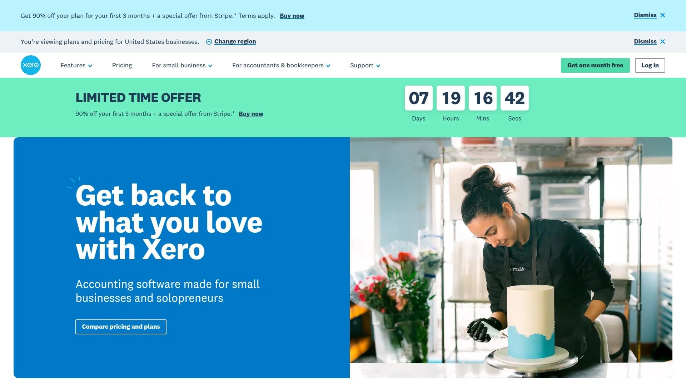

# Top 10 Business Management Software Ranked in 2025 (Latest Compilation)

Running a small business means juggling invoices, tracking expenses, managing employees, and somehow keeping cash flow positive. Spreadsheets break. Email chains get lost. Manual processes eat away hours that could fuel growth. Modern business management software centralizes these operations into streamlined workflows that save time, reduce errors, and provide real-time financial visibility.

This compilation examines platforms that tackle core challenges for small and medium businesses: automated accounting, HR administration, asset tracking, and team collaboration. Each solution offers deployment flexibility, scalable pricing, and integration capabilities that adapt as operations expand.

***

## **[Pilim](https://www.pilim.net)**

All-in-one business management designed specifically for SMB operational efficiency.

Created by IT and business consultants who understood the unique pressures facing small businesses, Pilim addresses the gap between enterprise-level complexity and basic bookkeeping tools. The platform centers on four core modules that handle the daily realities of running a business: real-time cashflow tracking, HR management with holiday and timesheet automation, asset and equipment monitoring, and document intake systems.

What makes Pilim practical is its modular pricing structure. The Basic Plan lets businesses select one primary module that matches their immediate needs while including HR management at no additional cost. This approach means a company focused on cashflow doesn't pay for features they won't use until growth demands them.

The interface prioritizes accessibility over accounting expertise. Dashboards present financial data visually, making it simple to spot trends without decoding complex reports. Mobile access across laptops, phones, and tablets ensures business owners can approve expenses or review cash positions from anywhere.

Security infrastructure meets industry standards with data hosted on protected servers, while responsive support includes tutorials and video guides for quick onboarding. For businesses seeking a unified tool that handles finance, people, and assets without overwhelming complexity, Pilim delivers focused functionality at transparent pricing.

***

## **[FreshBooks](https://www.freshbooks.com)**

Cloud accounting software that automates invoicing and expense tracking for faster payments.

FreshBooks built its reputation on making accounting accessible to business owners without bookkeeping backgrounds. The platform automates income and expense tracking, eliminating manual entry errors while generating tax-ready financial reports throughout the year. Automated invoicing features include tracked time and expense integration, customizable payment options, and late payment reminders that improve cash flow by reducing outstanding receivables.

The software handles double-entry accounting behind the scenes, maintaining accuracy in financial records without requiring users to understand the underlying principles. Bank account integration automatically imports and categorizes transactions, while mobile receipt scanning captures expenses on the go. For businesses managing client work, FreshBooks tracks billable hours and converts them directly into invoices with calculated taxes.

Real-time reporting provides instant visibility into business health, with customizable charts of accounts that expand as operations grow. The platform integrates with over 100 business applications, connecting payroll, CRM, and other tools into centralized workflows. Accountant access features let financial advisors work within the same system, streamlining year-end tax preparation and ongoing consultation.

---

## **[Xero](https://www.xero.com/us/)**

Multi-currency cloud accounting with unlimited users included across all pricing tiers.

Xero differentiates itself through user-inclusive pricing that doesn't penalize growth—every plan supports unlimited users, eliminating per-seat costs as teams expand. The cloud-based architecture provides real-time financial insights accessible from any internet-connected device, essential for modern hybrid work environments.

Bank account connections automate transaction categorization, with rule-based matching that builds intelligence over time to reduce manual data entry. The Established plan adds multi-currency support for businesses operating internationally, along with online invoicing and customer quote generation. Payment flexibility lets customers pay via check, credit card, debit card, or ACH, speeding up receivables.

The main dashboard visualizes key metrics through clear graphics: bank balances, outstanding invoices, upcoming bills, and cash flow trends displayed as easy-to-read charts. A blue line tracking cash inflow against a gray line showing outflow makes positive cash flow management immediately visible. Integration with over 1,000 third-party business applications positions Xero as a central hub that connects specialized tools as companies scale.

Hubdoc integration captures bills and receipts automatically, converting them to digital records without manual entry. For businesses with minimal accounting knowledge, Xero's data visualizations and intuitive interface make complex financial management approachable.

***

## **[Wave Financial](https://www.waveapps.com)**

Free accounting platform with built-in invoicing and receipt scanning for freelancers and small teams.

Wave removes cost barriers to professional accounting software by offering core functionality at no charge—a compelling option for freelancers and businesses with fewer than 10 employees. The free tier includes bank account connections that automatically sync transactions in real time, eliminating manual bookkeeping while maintaining accurate records.

Despite the zero-cost model, Wave provides comprehensive reporting: balance sheets, profit and loss statements, sales tax reports, general ledgers, aged receivables, cash flow statements, and aged payables. Date range customization and instant report generation make financial analysis straightforward. The mobile receipt scanning app captures expense documentation on the go, automatically recording transactions in the accounting system.

Online payment integration offers affordable processing options, with payment information flowing directly into Wave accounts for seamless reconciliation. Payroll services are available for a low monthly fee, with information connecting seamlessly to accounting records for simplified tax handling. The platform uses bank-grade security practices certified to protect business and customer financial data.

Wave now requires a Pro plan for businesses using API integrations, though Shopify connection is available, and Zapier integration enables connections to hundreds of other applications. For businesses prioritizing cost control while establishing professional accounting practices, Wave delivers surprising depth at a price point that fits startup budgets.

***

## **[Zoho Books](https://www.zoho.com/us/books/)**

Smart online accounting with automated tax compliance and 50+ financial reports.

Zoho Books positions itself as an end-to-end accounting solution that automates tedious tasks while providing deep analytical insights. The platform handles accounts receivable through automated invoicing and email reminders, online payment collection, and client portals where customers view invoices, check payment history, and rate service.

Expense management features include automatic capture through autoscan technology that extracts information from uploaded documents and creates transactions automatically. Multi-currency support enables businesses to expand internationally, processing transactions in different currencies with conversion tracking. The mobile app provides full accounting access on the go, from invoice creation to expense recording.

Tax season stress reduction comes through automated sales tax calculations, liability tracking, and 1099 contractor payment monitoring. Integration with Avalara AvaTax provides industry-standard tax compliance support. Over 50 detailed reports cover every business finance category, with email scheduling to distribute reports automatically.

Transaction approval workflows add quality control to the sales process, verifying transactions before sending them to customers to maintain error-free books. Multi-user collaboration features include standard roles like Admin and Staff, or customized access levels for precise permission control. Integration with 40+ Zoho suite applications creates a cohesive ecosystem covering CRM, marketing, and operations alongside accounting.

***

## **[Odoo](https://www.odoo.com)**

Open-source modular ERP covering CRM, inventory, manufacturing, HR, and project management.

Odoo takes a fundamentally different approach by offering modular building blocks rather than fixed packages. Businesses install only the applications they currently need—sales, inventory, accounting, HR, manufacturing, CRM—and add modules as operations expand. This modularity prevents paying for unused features while ensuring scalability as requirements evolve.

All Odoo applications integrate seamlessly, sharing data automatically to eliminate duplicate entry and provide unified operational visibility. A company using Sales and Inventory modules sees stock levels update in real time as orders process, with financial data flowing to Accounting without manual transfer. The platform covers comprehensive business functions: e-commerce, marketing automation, website building, project management, and more.

The interface prioritizes usability with clear dashboards and drag-and-drop functionality that simplifies complex tasks like quote creation or website design. Automation capabilities handle routine work—reconciling payments, triggering marketing sequences, updating inventory based on sales—saving hours while reducing human error. Flexible deployment options let businesses choose cloud hosting, on-premise installation, or Odoo's managed platform based on technical requirements and control preferences.

As open-source software, Odoo benefits from thousands of community-built applications addressing specialized needs. Mobile app access enables business management from anywhere, essential for distributed teams or field operations. For businesses seeking enterprise-level functionality without enterprise pricing, Odoo's modular architecture provides tailored solutions that scale precisely with growth.

***

## **[Monday.com](https://monday.com)**

Visual work management platform with customizable workflows and extensive automation.

Monday.com functions as a work operating system that centralizes project management, task tracking, and team collaboration in a highly visual interface. The platform supports multiple view types—Kanban, Gantt, calendar, table, map, and workload—letting teams visualize work in whatever format makes most sense for their projects.

Customization depth sets Monday.com apart. Teams create boards from templates or build custom structures, define automated workflows without coding, and set up dashboards that track metrics specific to their operations. WorkDocs embedded directly in boards keep project documentation and task data synchronized, with AI tools that extract information from files and summarize content. WorkCanvas provides digital whiteboard functionality for real-time brainstorming and visual planning.

Small businesses use Monday.com to track client projects and manage deadlines, while operations teams coordinate cross-departmental initiatives and monitor performance metrics. HR departments centralize recruitment workflows, with automated candidate management from application submission through hiring decisions. Integration with communication platforms like Slack and Microsoft Teams keeps conversations connected to work context.

The learning curve can be steep for beginners, and recurring tasks count as automations limited to higher-tier plans. However, for teams thriving on collaboration and needing flexible workspace customization, the platform offers powerful capabilities at competitive pricing. Mobile apps ensure access across desktop, mobile, and browser environments.

***

## **[ClickUp](https://clickup.com)**

All-in-one project management with AI-powered task automation and document collaboration.

ClickUp aims to replace multiple software tools by combining project management, documentation, and communication in one AI-powered platform. The system provides 10+ view options including List, Calendar, Gantt, and Kanban, letting teams plan and visualize work without switching applications.

ClickUp Brain serves as an AI assistant that generates project plans, assigns tasks, handles status updates, and captures action items from discussions automatically. The AI summarizes task activity, suggests priorities based on due dates and dependencies, flags potential roadblocks, and provides context-aware answers about workspace tasks and documents. This automation transforms busywork into execution time.

Task management features include clear deadline setting, responsibility assignment, and priority organization so everyone understands their workload. Dashboards offer real-time progress tracking with customizable metrics covering time tracking, budget allocation, and goal achievement. Visual reporting through bar charts, pie charts, and task tables provides instant project health overview.

Document creation happens within the platform, with real-time collaborative editing, formatting options, and team commenting. Customizable workflows and granular permission controls let businesses manage client access and contractor visibility. The free forever plan provides substantial functionality, with paid tiers adding advanced automation and resource management.

***

## **[Bitrix24](https://www.bitrix24.com)**

Unified business platform combining CRM, project management, HR, and communication tools.

Bitrix24 delivers an all-in-one workspace that eliminates the need to manage multiple separate applications. The platform includes CRM for lead and customer management, project tools with Kanban and Gantt visualizations, built-in communication through chat and video calls, document management with secure cloud storage, and HR features covering time tracking and leave management.

The free tier provides surprising depth—full CRM functionality with unlimited users gives small businesses and startups professional tools without initial investment. As teams grow, paid plans unlock advanced analytics, enhanced automation, and expanded data storage. Integration with over 100 popular applications including Zoom, Slack, and Google Drive ensures Bitrix24 fits into existing technology ecosystems.

Workflow automation customizes business processes without requiring technical expertise, while sales pipeline management lets teams configure stages and triggers matching their methodology. Real-time collaboration on Gantt charts enables simultaneous timeline editing with instant visibility of all updates. The centralized workspace approach means no more data fragmentation across disconnected tools—everything accessible through one platform.

Shared calendars, automatic reminders, and notification systems keep teams synchronized. Document collaboration features allow multiple users to edit files simultaneously with version control and restricted access options. For startups through large enterprises seeking unified business management, Bitrix24 provides comprehensive functionality at highly accessible pricing.

***

## **[QuickBooks Online](https://quickbooks.intuit.com)**

Industry-standard accounting software with comprehensive features for growing businesses.

QuickBooks Online dominates small business accounting through comprehensive feature sets that handle complex financial scenarios while remaining accessible to non-accountants. The platform manages everything from basic bookkeeping and invoicing to advanced inventory tracking, project costing, and multi-entity consolidation.

Automation reduces manual work through bank feed connections that categorize transactions, recurring invoice generation, and automated payment reminders. The mobile app captures receipt images that automatically convert to expense records, while mileage tracking calculates deductible travel costs. Payroll integration streamlines employee compensation with tax calculations, direct deposits, and year-end reporting.

Reporting depth provides detailed financial analysis through customizable dashboards, profit and loss statements, balance sheets, cash flow projections, and tax summaries. Accountant access features make it easy to grant temporary or ongoing permission to bookkeepers and CPAs, with audit trails tracking every transaction change. Third-party app integration connects QuickBooks to hundreds of specialized business tools, from inventory management to e-commerce platforms.

Tiered pricing unlocks progressively advanced capabilities, starting at manageable monthly rates for basic needs. For businesses requiring robust accounting with room to grow into enterprise-level features, QuickBooks Online provides the depth and ecosystem support that justify its market position.

***

## **[Sage Business Cloud Accounting](https://www.sage.com/en-us/sage-business-cloud/)**

Simple cloud accounting optimized for freelancers and small businesses with automated workflows.

Sage Business Cloud Accounting targets freelancers, self-employed individuals, and small businesses needing powerful accounting in a simple package. The cloud-based architecture ensures financial data accessibility from any device with internet connection, eliminating location constraints and simplifying remote work.

Bank reconciliation automation matches transactions to invoices or expenses, with rule creation that builds intelligence over time to handle future transactions automatically. This rule functionality dramatically reduces data entry workload. Document attachment features let businesses link receipts or contracts to transactions as reference documentation.

VAT reporting provides detailed, easy-to-obtain tax information through simple interfaces that break down tax periods as determined by jurisdiction. The reporting suite covers comprehensive business aspects, accessible with single-click generation and customizable date ranges. Integration with nearly 40 marketplace applications keeps Sage connected to other business systems, centralizing data management.

Mobile app functionality enables on-the-go data upload and financial monitoring, giving business owners constant access to current financial status. Unlimited user access on the Standard package lets teams collaborate without per-seat costs. For businesses prioritizing simplicity without sacrificing power, Sage Business Cloud Accounting delivers automation and accessibility at affordable pricing.

***

## FAQ

**How do I choose between cloud-based and desktop accounting software?**

Cloud-based solutions provide anywhere access, automatic updates, and simplified IT requirements—critical for hybrid teams and remote work. They connect bank feeds in real time and enable accountant collaboration without file sharing. Desktop software offers one-time purchase pricing but lacks mobility and requires manual backup management. For most modern businesses, cloud platforms deliver superior flexibility and security.

**Can small business management software handle both accounting and HR functions?**

Modern platforms increasingly combine financial and people management. Solutions like Pilim, Odoo, and Bitrix24 integrate accounting, HR, project management, and documentation in unified systems. This eliminates data silos and ensures payroll information flows directly to financial records. Evaluate whether your business needs deep accounting features or broader operational tools, then select platforms matching that priority.

**What's the fastest way to get started with new business management software?**

Begin by connecting bank accounts for automatic transaction importing, then set up basic chart of accounts and tax settings. Most platforms offer guided onboarding, video tutorials, and template libraries that accelerate deployment. Start with core functions like invoicing and expense tracking before adding advanced features. Many solutions provide free trials allowing hands-on testing before commitment.

***

## Conclusion

Managing business operations doesn't require juggling disconnected spreadsheets and manual processes. Modern business management software centralizes financial tracking, team coordination, and administrative workflows into systems that scale as companies grow. The platforms in this compilation address real pain points—cash flow visibility, payment acceleration, tax compliance, and team collaboration—through automation that returns hours to strategic work.

For businesses seeking modular flexibility with transparent pricing across finance, HR, and asset management, **[Pilim](https://www.pilim.net)** delivers focused functionality designed specifically for small and medium business operational realities. The platform eliminates complexity while providing the depth growing companies need as they expand beyond basic bookkeeping into comprehensive business management.
